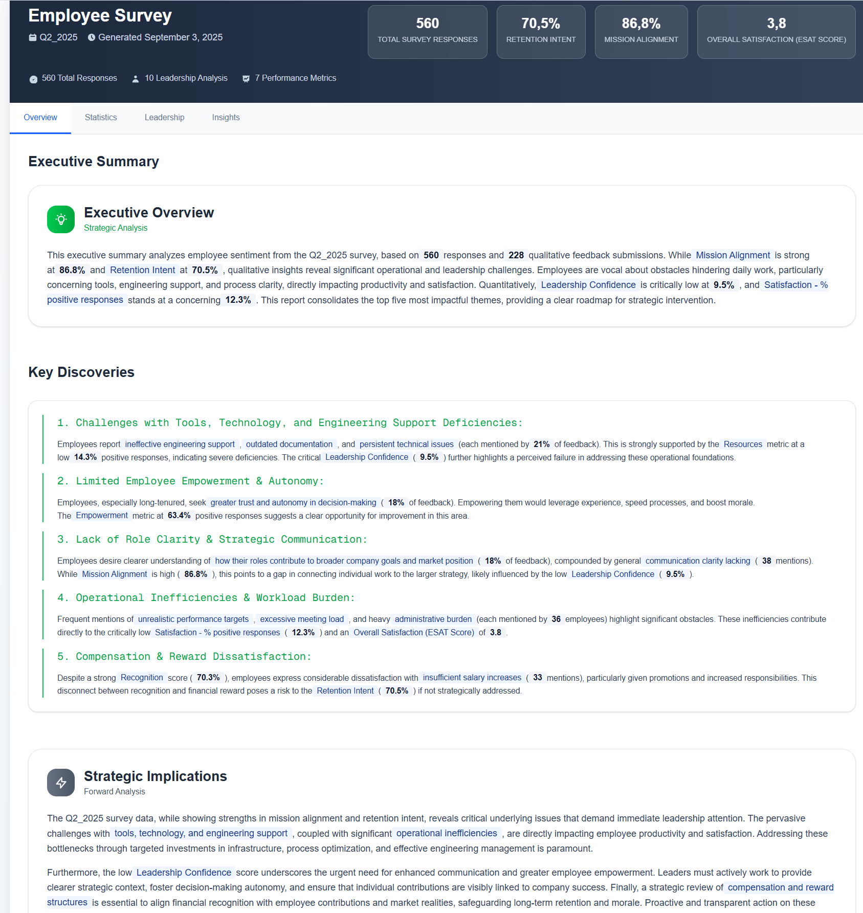
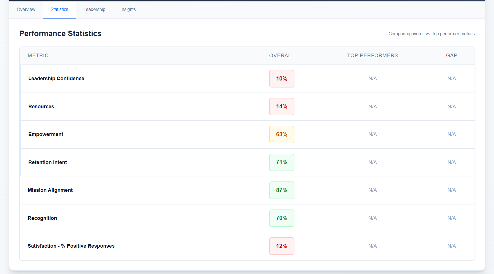
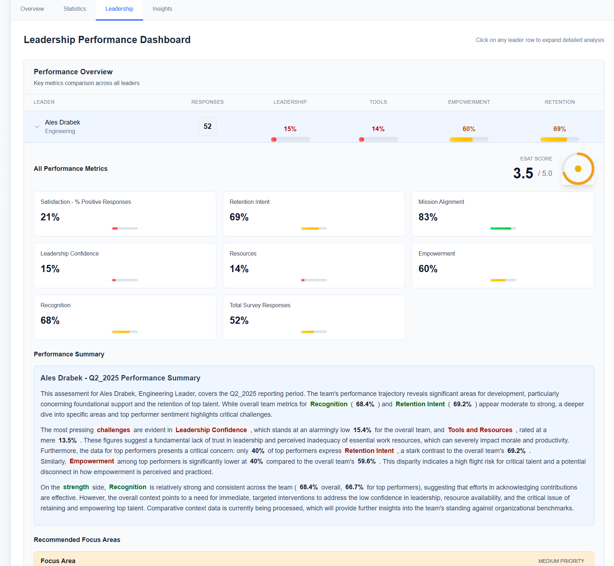
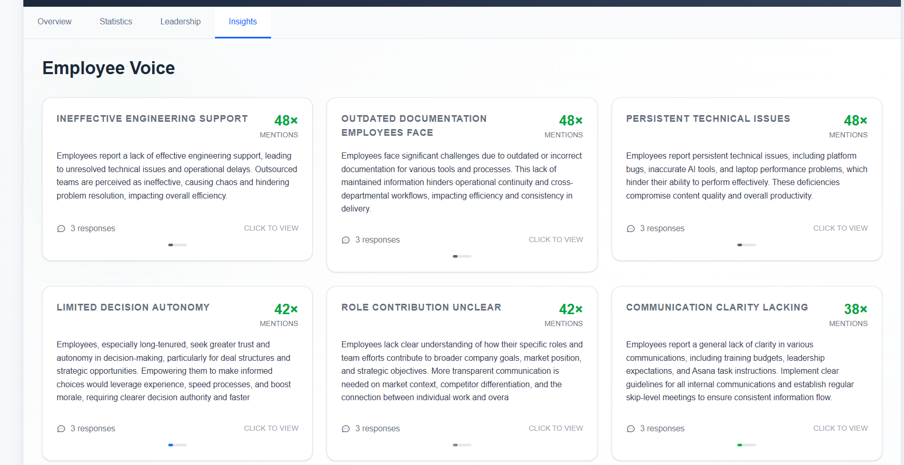

# Employee Survey Analytics - NextJS Migration

A modern, responsive web application for visualizing employee survey data, migrated from a Handlebars-based Node.js application to a NextJS React application with Tailwind CSS.

## 🚀 Features

- **Drag & Drop JSON Upload**: Easy file upload with drag-and-drop functionality
- **Flexible Data Validation**: Gracefully handles incomplete or varying JSON structures
- **Responsive Design**: Optimized for desktop, tablet, and mobile devices
- **Interactive Tabs**: Navigate between Overview, Statistics, Leadership, and Insights
- **Modern UI**: Built with Tailwind CSS for a clean, professional appearance
- **TypeScript Support**: Full type safety and IntelliSense support

## 📊 Data Visualization Components

### Overview Tab
- Executive summary with key findings
- Strategic implications
- Key organizational strengths and improvement areas
- Performance level indicators with color coding



### Statistics Tab
- Performance metrics comparison table
- Overall vs. Top Performers analysis
- Performance gap calculations
- Summary cards for highest/lowest performing metrics



### Leadership Tab
- Accordion-style leader analysis
- Individual performance metrics
- Focus areas and recommendations
- Leadership confidence indicators



### Insights Tab
- Strategic insights and recommendations
- Qualitative feedback analysis
- Action items and next steps
- Rich HTML content parsing




## 🛠 Technology Stack

- **Framework**: Next.js 15.5.2 with App Router
- **Language**: TypeScript
- **Styling**: Tailwind CSS 4.0
- **Build Tool**: Turbopack
- **React**: 19.1.0

## 📁 Project Structure

```
src/
├── app/
│   ├── globals.css
│   ├── layout.tsx
│   └── page.tsx
├── components/
│   ├── DashboardHeader.tsx      # Header with survey metadata
│   ├── FileUpload.tsx          # Drag & drop file upload
│   ├── SurveyDashboard.tsx     # Main dashboard component
│   └── tabs/
│       ├── OverviewTab.tsx     # Executive summary & key metrics
│       ├── StatisticsTab.tsx   # Performance statistics
│       ├── LeadershipTab.tsx   # Leadership analysis
│       └── InsightsTab.tsx     # Strategic insights
└── types/
    └── survey.ts               # TypeScript type definitions
```


## 🚀 Getting Started

1. **Clone and Navigate**:
   ```bash
   cd mk/groupon/emp
   ```

2. **Install Dependencies**:
   ```bash
   npm install
   ```

3. **Run Development Server**:
   ```bash
   npm run dev
   ```

4. **Open Browser**:
   Navigate to `http://localhost:3000`

5. **Upload Data**:
   Drag and drop your survey JSON file or click to browse

## 🔧 Available Scripts

- `npm run dev` - Start development server with Turbopack
- `npm run build` - Build production application
- `npm run start` - Start production server
- `npm run lint` - Run ESLint

## 🎨 Design Philosophy

### Color Coding System
- **Green**: Strengths, high performance (≥70%)
- **Yellow**: Medium performance (50-69%)
- **Red**: Areas needing attention (<50%)
- **Blue**: Information, metadata, strategic insights
- **Purple**: Key findings, important highlights
- **Orange**: Action items, focus areas

### Performance Levels
- **High**: 70%+ (Green indicators)
- **Medium**: 50-69% (Yellow indicators)  
- **Low**: <50% (Red indicators)


## 🤝 Contributing

1. Follow the existing component structure
2. Use TypeScript for type safety
3. Implement responsive design with Tailwind
4. Add proper error handling
5. Test with various JSON structures

